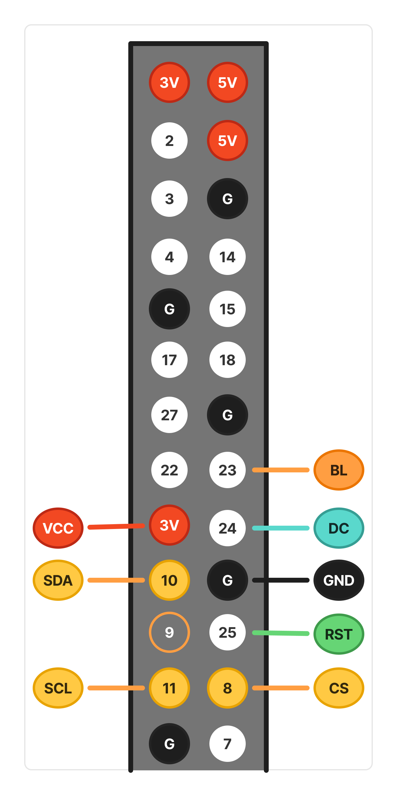

# pi0disp - Raspberry Pi用 ST7789V 超低負荷・高速ディスプレイドライバ

## 概要

`pi0disp` は、Raspberry Pi Zero 2W を含むリソースの限られた環境で、ST7789V 搭載ディスプレイを最大限の効率で駆動するために開発された Python 製ディスプレイドライバです。

単なる SPI 送信ライブラリにとどまらず、**「動的差分更新 (Dirty Rectangle)」** や **「低レベルピン操作のキャッシュ」** といった高度な最適化技術をドライバレベルで標準実装しています。これにより、滑らかなアニメーションやリアルタイム UI を表示しながら、システム全体の CPU 負荷を劇的に抑えることが可能です。


## 特徴

- **超低負荷な描画**: 自動差分検出により、画面内の変更があった最小領域のみを SPI 送信します。静止時や微小な変化時の通信コストを 90% 以上削減可能です。
- **低レベル通信の最適化**: DC/CS ピンの状態をドライバ側で管理（キャッシュ）し、冗長なシステムコールを排除。SPI 帯域を最大限に活用します。
- **Pillow / NumPy 互換**: 標準的な `PIL.Image` オブジェクトをそのまま `display()` に渡すだけで、最適な転送処理が自動的に行われます。
- **アニメーションに最適**: 10〜20 FPS 程度の滑らかな動きを、Raspberry Pi Zero 上でも極めて低い CPU 負荷で維持できるよう設計されています。


## 要件

### ハードウェア

- Raspberry Pi
- ST7789V搭載 SPIディスプレイ


### ソフトウェア

- Python 3.11 以降
- `pigpio`: ライブラリ、デーモン

```sh
# pigpioのインストール
sudo apt update
sudo apt install pigpio

# pigpioデーモンの起動
sudo systemctl start pigpiod
```


## 配線図(例)

- RST, DC, BL は、変更可




## インストール

### ``mise`` のインストール
[mise-en-place](https://mise.jdx.dev/installing-mise.html)

``` bash
curl https://mise.run | sh
```

for bash
``` bash
curl https://mise.run/bash | sh
```


### ``uv`` のインストール

``` bash
mise use -g uv@latest
```


### ``pi0disp`` のインストール


```bash
git clone <repository_url>
cd pi0disp

mise trust
```


```bash
pip install -e .
```

開発用の依存関係を含める場合は、以下のようにインストールしてください。
```sh
pip install -e . --group dev
```


## 使い方

### ライブラリとしての利用

`pi0disp`のコア機能は `ST7789V` クラスです。
Pythonスクリプトから直接インポートして使用できます。

以下のコード例は [`samples/basic_usage.py`](./samples/basic_usage.py) としても保存されており、実際に実行して動作を確認できます。

``` sh
uv run samples/basic_usage.py
```

**基本的な使用例:**

```python
from pi0disp import ST7789V
from PIL import Image, ImageDraw

with ST7789V(bl_at_close=True) as lcd:  # ディスプレイを初期化
    width = lcd.size.width    # 画面の幅
    height = lcd.size.height  # 画面の高さ
    margin = 25               # 余白
    line_width = 10           # 先の太さ

    image = Image.new("RGB", (width, height), "white")  # 土台となる画像
    draw = ImageDraw.Draw(image)                        # 描画するためのキャンバス

    draw.ellipse(                                       # 楕円の描画
        (
         (margin, margin),                  # 左上の座標
         (width - margin, height - margin)  # 右下の座標
        ),
        fill="blue",       # 塗り潰しの色
        width=line_width,  # 線の太さ
        outline="red"      # 線の色
    )

    lcd.display(image)  # ディスプレイに表示
```

**部分更新（差分描画）:**

変更があった領域のみを転送することで、より高いパフォーマンスを実現できます。

```python
    # ... (上記のコードに続けて)

    # 画像の一部を変更
    draw.rectangle((50, 50, 100, 100), fill="red")

    # 変更された領域のみをディスプレイに転送
    lcd.display_region(image, 50, 50, 100, 100)
```

### CLIツール (動作確認用)

インストール後、`pi0disp`コマンドで動作確認用のツールを利用できます。

#### ヘルプの表示

```sh
uv run pi0disp --help
```

#### パフォーマンスデモ: `ball_anime`

バウンドするボールのアニメーションデモを実行し、描画パフォーマンスを測定します。これはドライバの差分描画機能のデモンストレーションです。

```sh
uv run pi0disp ball_anime
```

**オプション例:**

-   ターゲットFPSを60に、ボールの数を5に設定:
    ```sh
    uv run pi0disp ball_anime --fps 60 --num-balls 5
    ```
-   SPI通信速度を40MHzに設定:
    ```sh
    uv run pi0disp ballanime --speed 40000000
    ```

デモは `Ctrl+C` で終了します。

#### ディスプレイをオフにする

ディスプレイをスリープモードに移行させ、バックライトを消灯します。

```sh
uv run pi0disp off
```


## パフォーマンス・ベンチマーク

最新の `pi0disp` ライブラリは、Raspberry Pi 上での CPU 負荷と SPI 通信時間を極限まで抑えるよう設計されています。

| 項目 | 指標 (10 FPS 時) | 備考 |
| :--- | :--- | :--- |
| **`pigpiod` CPU負荷** | **約 10% 以下** | 動的差分更新により通信量を最小化 |
| **描画時間 (render)** | **1ms 〜 3ms** | Python 側の描画処理負荷 |
| **通信時間 (display)** | **0.8ms 〜 40ms** | 変化した領域のサイズに応じて変動 |

※ 測定環境: Raspberry Pi Zero 2W / ST7789V (320x240) / `samples/roboface3.py` 実行時。


## パフォーマンス最適化ガイド

このドライバの性能を最大限に引き出し、リソースの限られた環境でも滑らかな UI を実現するための実装パターンを紹介します。

### 1. 動的差分更新 (Dirty Rectangle) の活用

`display(image)` メソッドは、内部で前回のフレームとの差分を自動検出し、変化があった領域のみを SPI 送信します。
アプリケーション側で **「同じ画像オブジェクトを使い回して、変更点だけを書き換える」** パターンを採用することで、通信負荷を劇的に下げることができます。

```python
# --- 推奨される実装パターン ---
with ST7789V() as lcd:
    # 土台となる画像を一度だけ作成
    image = Image.new("RGB", (lcd.width, lcd.height), "black")
    draw = ImageDraw.Draw(image)
    last_pos = None

    while True:
        # 1. 前回の描画箇所を背景色で消去（軌跡が残るのを防ぐ）
        if last_pos:
            draw.rectangle(last_pos, fill="black")

        # 2. 新しい位置にパーツを描画
        curr_pos = get_current_ui_state()
        draw.rectangle(curr_pos, fill="red")
        last_pos = curr_pos
        
        # 3. display() を実行。
        # 消去した領域と描画した領域の「差分」だけが自動的に送信されます。
        lcd.display(image)
```

### 2. 背景キャッシュ戦略

外枠や目盛り、固定テキストなど、変化しないパーツを毎フレーム `ImageDraw` で描画し直すのは非効率です。
**不変な背景イメージを一度だけ生成してキャッシュ**し、ループ内ではそれをコピーして動的パーツを重ねる手法を推奨します。

```python
# 初期化時に「不変な背景」を作っておく
bg_cache = Image.new("RGB", (320, 240), "blue")
render_static_ui(bg_cache)

while True:
    # キャッシュをコピー（Image.new よりも遥かに高速）
    frame = bg_cache.copy()
    draw = ImageDraw.Draw(frame)
    
    # 動的なパーツ（針や数値など）だけを描画
    render_dynamic_values(draw)
    
    # 差分のみが SPI 送信される
    lcd.display(frame)
```

### 3. FPS（更新頻度）の適切な管理

人間の目には 10〜20 FPS 程度でも十分に滑らかに見えます。システム時刻の変更に影響されない高精度な `time.perf_counter()` を使用して、アプリケーションの更新頻度を適切に制御してください。

```python
target_fps = 10
interval = 1.0 / target_fps

while True:
    start_time = time.perf_counter() # 高精度な開始時刻
    
    do_app_logic()
    
    # 目標 FPS を維持するための待機時間を計算
    wait_time = max(0, interval - (time.perf_counter() - start_time))
    time.sleep(wait_time)
```

### 4. `display()` と `display_region()` の使い分け

自動差分検知がある `display()` と、座標を直接指定する `display_region()` を適切に使い分けることで、さらに効率を高められます。

-   **`display(image)` を使うべき時 (利便性・複雑な更新向け)**
    -   どこが変化したか計算するのが複雑な場合。
    -   画面の広範囲がバラバラに変化する場合。
-   **`display_region(image, x0, y0, x1, y1)` を使うべき時 (極限の最適化向け)**
    -   更新箇所が完全に決まっている場合（例：UI部品の数値のみ書き換える）。
    -   「画面の右上」と「左下」のように、離れた2箇所だけを更新したい場合（`display()` はこれらを包む大きな矩形を送信しますが、`display_region()` を2回呼べば最小限の転送で済みます）。
    -   差分抽出の計算負荷（Pillow によるピクセル比較）さえも削りたい場合。

### 4. `display()` と `display_region()` の使い分け

自動差分検知がある `display()` と、座標を直接指定する `display_region()` を適切に使い分けることで、さらに効率を高められます。

-   **`display(image)` を使うべき時 (利便性・複雑な更新向け)**
    -   どこが変化したか計算するのが複雑な場合。
    -   画面の広範囲がバラバラに変化する場合。
-   **`display_region(image, x0, y0, x1, y1)` を使うべき時 (極限の最適化向け)**
    -   更新箇所が完全に決まっている場合（例：UI部品の数値のみ書き換える）。
    -   「画面の右上」と「左下」のように、離れた2箇所だけを更新したい場合（`display()` はこれらを包む大きな矩形を送信しますが、`display_region()` を2回呼べば最小限の転送で済みます）。
    -   差分抽出の計算負荷（Pillow によるピクセル比較）さえも削りたい場合。


## ライセンス

このプロジェクトは [MITライセンス](LICENSE) の下で公開されています。


## 付録：内部最適化アルゴリズムの解説

### 動的差分抽出 (Dirty Rectangle)

`PIL.ImageChops.difference` を用いて現フレームと前フレームの差分画像を生成し、`getbbox()` メソッドで変化のあった最小の矩形領域を特定しています。
これにより、Python レベルの重いループを介さず、C 言語で実装された Pillow の高速な画像演算のみで更新が必要な領域を特定（1ms 以下）しています。

### 低レベル通信の効率化

- **ピン状態キャッシュ**: DC（Data/Command）ピンや CS（Chip Select）ピンの現在のレベルをライブラリ側で保持し、不必要な `pi.write()` 呼び出し（システムコール）をスキップします。
- **ウィンドウ設定の最適化**: 以前の座標と同じウィンドウ設定が要求された場合、座標設定コマンド (`CASET`, `RASET`) の送信をスキップします。
- **適応的チャンク分割**: SPI 送信時のバッファサイズを、OS のリソース制限や通信効率に合わせて最適に調整しています。
