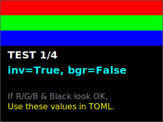

# ST7789V ディスプレイドライバ リファレンスマニュアル

`pi0disp` ライブラリに含まれる `ST7789V` クラスは、Raspberry Pi 用に最適化された高速なディスプレイドライバです。

---

## 外部プロジェクトでの利用

`pi0disp` を自分のプログラムで使用するには、以下のいずれかの方法でインストールしてください。

### 1. `uv` を使用する場合 (推奨)

GitHubのリポジトリを直接指定して追加できます。

```bash
# GitHubから最新版をインストール
uv add git+https://github.com/ytani01/pi0disp.git
```

ローカルにある `pi0disp` を編集しながら利用したい場合は、パスを指定して `--editable` で追加します。

```bash
# ローカルパスから追加 (編集内容が即座に反映される)
uv add --editable /path/to/pi0disp
```

### 2. `pip` を使用する場合

```bash
# GitHubからインストール
pip install git+https://github.com/ytani01/pi0disp.git
```

ビルドした成果物（.whlファイル）を使用する場合は以下の手順で行います。

1. `pi0disp` ディレクトリでビルドを実行:
   ```bash
   uv build
   ```
2. 自分のプロジェクトで、生成されたファイルを指定してインストール:
   ```bash
   pip install /path/to/pi0disp/dist/pi0disp-*.whl
   ```

---

## 設定ファイル: `pi0disp.toml`

プロジェクトのルートディレクトリに `pi0disp.toml` を配置することで、動作を詳細にカスタマイズできます。ここに設定を記述しておけば、プログラム側での引数指定を最小限に抑えられます。

### `[pi0disp]` セクション (ディスプレイ基本設定)

| 項目名 | 説明 | デフォルト値 |
| :--- | :--- | :--- |
| `width` | ディスプレイの物理的な幅 (ピクセル) | 240 |
| `height` | ディスプレイの物理的な高さ (ピクセル) | 320 |
| `rotation` | 初回の回転角度 (0, 90, 180, 270) | 0 |
| `x_offset` | 描画開始位置のXオフセット | 0 |
| `y_offset` | 描画開始位置のYオフセット | 0 |
| `invert` | 色反転の有効(`true`)/無効(`false`) | `true` |
| `rgb` | `true`でRGB、`false`でBGR順序を使用 | `true` |

### `[pi0disp.spi]` セクション (ハードウェア接続設定)

| 項目名 | 説明 | デフォルト値 |
| :--- | :--- | :--- |
| `cs` | SPI Chip Select ピン (GPIO番号) | 8 |
| `rst` | Reset ピン (GPIO番号) | 25 |
| `dc` | Data/Command ピン (GPIO番号) | 24 |
| `bl` | バックライト制御ピン (GPIO番号) | 23 |
| `channel` | SPI チャンネル (0 または 1) | 0 |
| `speed_hz` | SPI 通信クロック周波数 (Hz) | 40000000 |

---

## 最適な設定の確認 (`lcd_check.py`)

使用しているパネルに最適な `invert` と `rgb` 設定を特定するためのツールです。

```bash
uv run samples/lcd_check.py
```

### 画面の見え方（正常な状態のイメージ）

背景が漆黒になり、上から順に **赤・緑・青** の帯が見える設定を探してください。



画面の指示に従い、正しく見える設定値を `pi0disp.toml` に記入してください。

---

## クイックスタート (図形とテキストの描画)

```python
import time
from PIL import Image, ImageDraw, ImageFont
from pi0disp.disp.st7789v import ST7789V

# 初期化 (設定ファイルの内容が自動的に読み込まれます)
disp = ST7789V(rotation=ST7789V.EAST)

# キャンバスの作成と描画
img = Image.new("RGB", (disp.size.width, disp.size.height), "black")
draw = ImageDraw.Draw(img)
draw.rectangle([20, 20, 100, 100], outline="red", width=3)

# 表示
disp.display(img)
time.sleep(5)
disp.close()
```

---

## API リファレンス

### `ST7789V` クラス

#### コンストラクタ: `ST7789V(...)`
ドライバを初期化し、SPI通信およびGPIOの準備を行います。
引数を省略した場合、`pi0disp.toml` またはシステムデフォルト値が使用されます。

```python
disp = ST7789V(
    pin=None,
    brightness=255,
    channel=0,
    speed_hz=None,
    size=None,
    rotation=None,
    x_offset=None,
    y_offset=None,
    invert=None,
    bgr=None,
    debug=False
)
```

- **`pin`** (SpiPins): `cs`, `rst`, `dc`, `bl` ピンの番号をまとめたオブジェクト。通常は `pi0disp.toml` で指定します。
- **`brightness`** (int): 初期輝度 (0-255)。
- **`channel`** (int): SPIチャンネル (0 または 1)。
- **`speed_hz`** (int): SPI通信速度。指定しない場合は 40MHz がデフォルトです。
- **`size`** (DispSize): `width` と `height` を持つサイズオブジェクト。
- **`rotation`** (int): 初期回転角度 (`0`, `90`, `180`, `270`)。
- **`x_offset`, `y_offset`** (int): パネルの特性に合わせた表示オフセット。
- **`invert`** (bool): `True` で色反転を有効にします。
- **`bgr`** (bool): `True` で BGR、`False` で RGB カラー順序を使用します。
- **`debug`** (bool): `True` にすると詳細なログを出力します。

---

### メソッド

#### `display(image: Image.Image)`
画面全体に画像を表示します。画像は自動的にディスプレイサイズに合わせてリサイズ・回転処理されます。

#### `display_region(image: Image.Image, x0, y0, x1, y1)`
指定した矩形領域（左上 `x0, y0` から右下 `x1, y1`）のみを更新します。

#### `set_rotation(rotation: int)`
表示方向を変更します。以下の定数を使用できます。
- `ST7789V.NORTH` (0)
- `ST7789V.EAST` (90)
- `ST7789V.SOUTH` (180)
- `ST7789V.WEST` (270)

#### `set_brightness(brightness: int)`
バックライトの輝度を `0`（消灯）〜 `255`（最大）の間で変更します。

#### `set_backlight(on: bool)`
バックライトを点灯 (`True`) または消灯 (`False`) します。

#### `close()`
ディスプレイをスリープさせ、リソースを解放します。`with` 構文を使用した場合は自動的に呼び出されます。
この際、バックライトも自動的に消灯します。